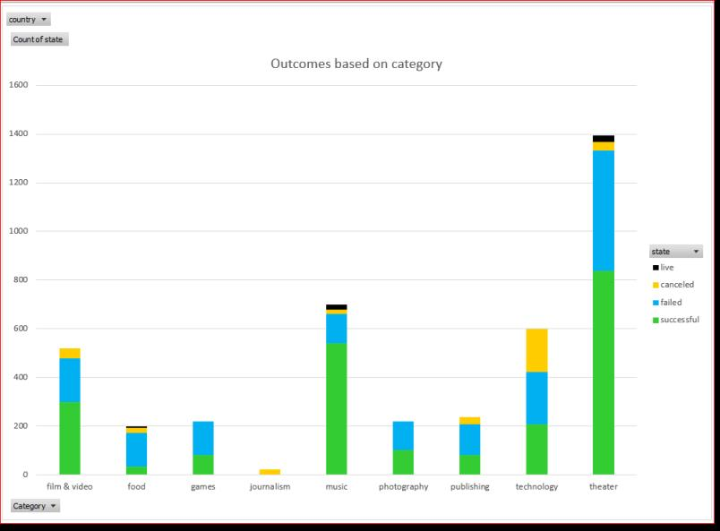
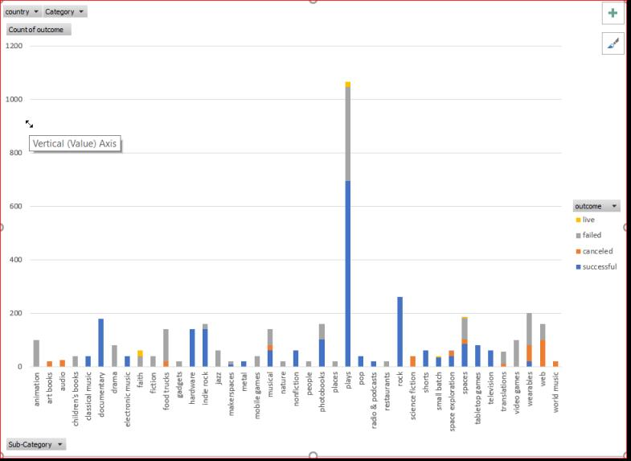
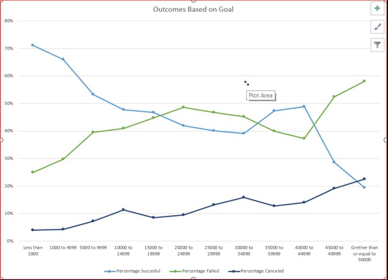

# KickStart My Chart

### Background

Over two billion dollars have been raised using the massively successful crowdfunding service, Kickstarter, but not every project has found
success. Of the over 300,000 projects launched on Kickstarter, only a third have made it through the funding process with a positive
outcome.

Since getting funded on Kickstarter requires meeting or exceeding the project's initial goal, many organizations spend months looking 
through past projects in an attempt to discover some trick to finding success. 

### Conclusions

Using advanced Excel, I analyzed the data of four thousand past Kickstarter projects to uncover some of the market trends.
 
* CHART Outcomes based on categories:
    
        
    
 In the above chart we find that  59% of all campaigns are successful, which is overall a high success rate. 
 Music, Theatre, Film&Video have been the categories with highest successful outcomes among all categories.
 Food is the category with lowest success rate. Journalism has a very negative outcome that we should investigate 
 (was there some explanation for why all campaigns were cancelled?). 
 
 * CHART Outcomes based on sub-categories:
 
    
    
 Campaigns with the lowest goal have highest success rate (71%) versus campaigns with the highest goal have the lowest success rate (20%). Consider splitting a campaign so it can reach its target quicker.   
 
 * CHART Outcomes based on goal:
  
    
    
 Months with highest success rate are in the beginning of the year (Feb, Apr and May). The month with lowest success rate is December.
 We may consider running our campaigns in the beginning of the year, as opposed to during holidays. No other obvious strong seasonality
 trend.   
 
 
 
